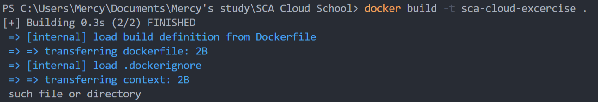
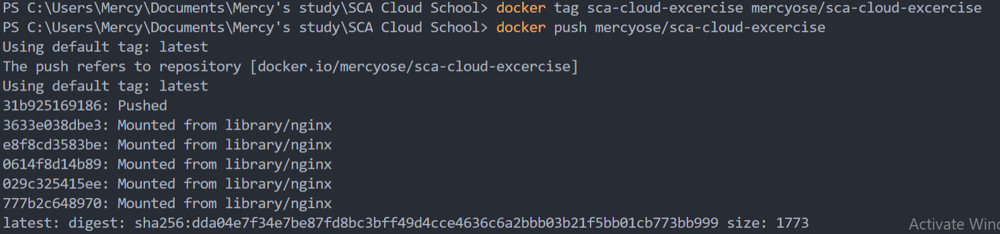

# SCA Cloud Application School Exercise

This readme very clearly describes the test process and it's output, it also shows the instructions and documentaion used for the deployment in this excercise.

**Creating the Dockerfile that displays a webpage, each layers are inputted**

**Building the docker image, this command is run**

*docker build -t sca-cloud-exercise*

*docker run -p 3000:80 sca-cloud-exercise*

**The docker image is tagged, this command is run**

*docker tag sca-cloud-excercise mercyose/sca-cloud-excercise*

**The docker image is pushed to docker hub, this command is run**

*docker push mercyose/sca-cloud-excercise*

